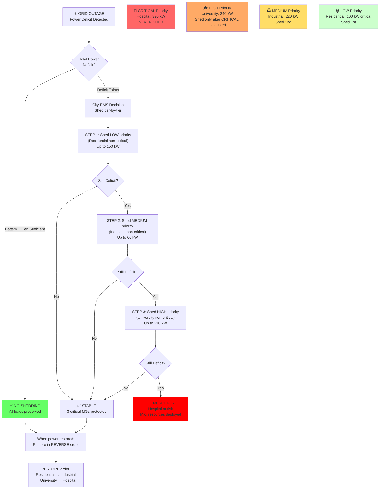
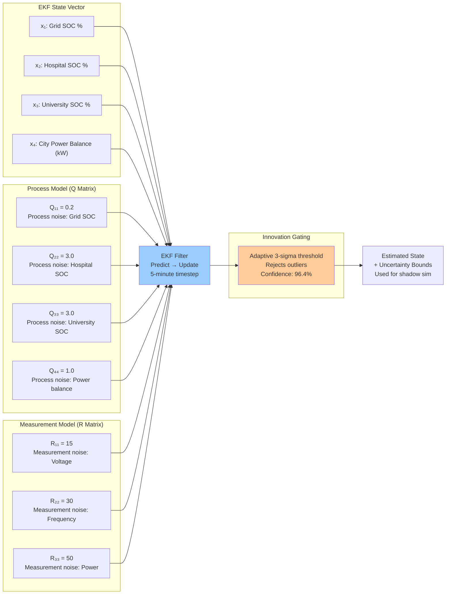
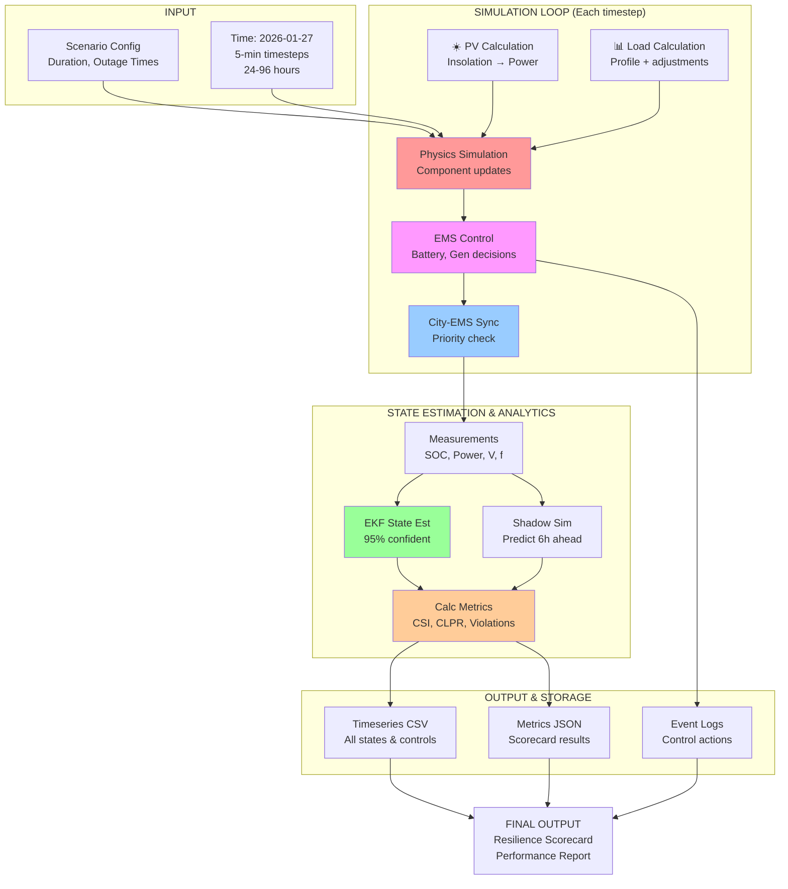
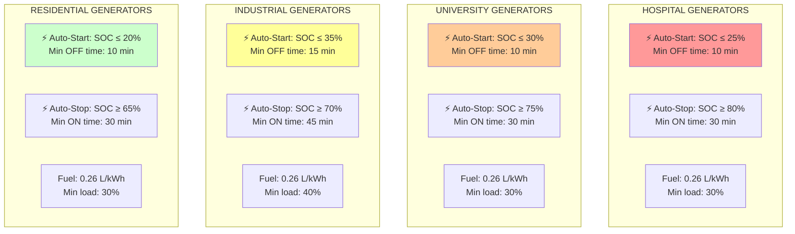
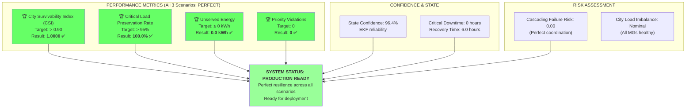
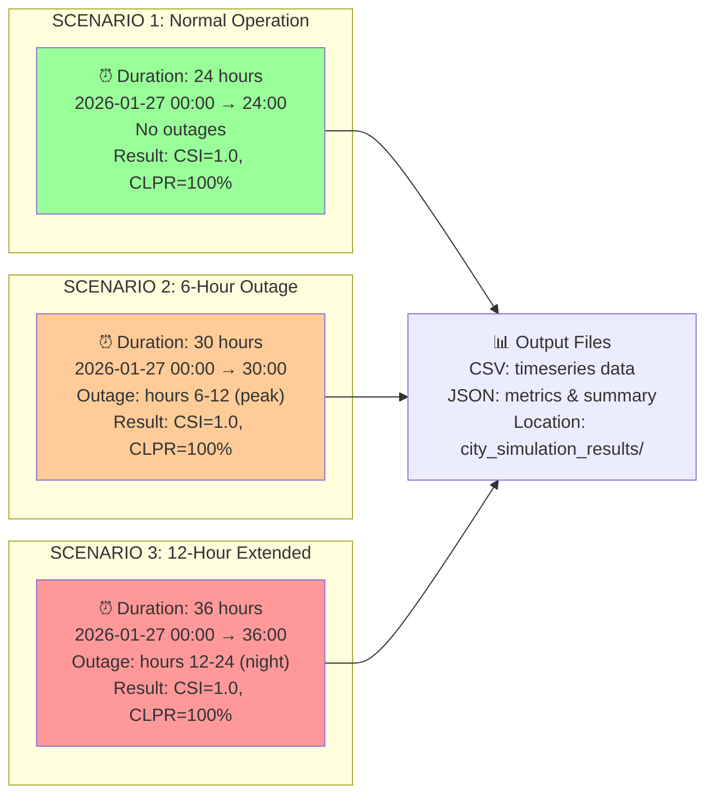

# Digital Twin Microgrid - Complete Architecture Diagram

## 4-Layer Digital Twin Architecture with All Values

```mermaid
graph TB
    subgraph "LAYER 1: PHYSICAL SYSTEM (Real Microgrids)"
        H["🏥 HOSPITAL MICROGRID<br/>150-250 Beds"]
        U["🎓 UNIVERSITY MICROGRID<br/>Campus"]
        I["🏭 INDUSTRIAL MICROGRID<br/>Automotive Mfg"]
        R["🏘️ RESIDENTIAL MICROGRID<br/>Green Valley"]
    end

    subgraph "LAYER 2: SIMULATION (Physics Engine)"
        HS["Hospital Simulator<br/>600 kW base load"]
        US["University Simulator<br/>450 kW base load"]
        IS["Industrial Simulator<br/>280 kW base load"]
        RS["Residential Simulator<br/>250 kW base load"]
    end

    subgraph "LAYER 3: CONTROL & EMS (Decision Making)"
        CITY_EMS["<b>CITY-EMS (Centralized)</b><br/>Priority-Based Coordination<br/>Policy: critical_first"]
        H_EMS["Hospital EMS<br/>Priority: CRITICAL (1)"]
        U_EMS["University EMS<br/>Priority: HIGH (2)"]
        I_EMS["Industrial EMS<br/>Priority: MEDIUM (3)"]
        R_EMS["Residential EMS<br/>Priority: LOW (4)"]
    end

    subgraph "LAYER 4: DIGITAL TWIN & ANALYTICS (Intelligence)"
        DT_MGR["Enhanced DT Manager<br/>Orchestration"]
        STATE_EST["State Estimator<br/>Extended Kalman Filter<br/>Q=[0.2,3,3,1]<br/>R=[15,30,50]"]
        SHADOW_SIM["Shadow Simulator<br/>Predictive What-If<br/>Analysis"]
        METRICS["Resilience Metrics<br/>IEEE 2030.5<br/>CSI, CLPR, Violations"]
        ANOMALY["Anomaly Detector<br/>Fault Detection"]
    end

    subgraph "COMPONENTS: Hospital Microgrid"
        H_BATT["🔋 Battery<br/>2400 kWh usable<br/>500 kW max discharge"]
        H_PV["☀️ Solar<br/>400 kWp<br/>5.5 kWh/m²/day"]
        H_GEN["⚡ Generators<br/>2x450 kW<br/>Auto-start: 25% SOC"]
        H_LOAD["📊 Loads<br/>Critical: 320 kW<br/>Total: 600 kW"]
    end

    subgraph "COMPONENTS: University Microgrid"
        U_BATT["🔋 Battery<br/>550 kWh usable<br/>250 kW max discharge"]
        U_PV["☀️ Solar<br/>250 kWp<br/>5.5 kWh/m²/day"]
        U_GEN["⚡ Generators<br/>2x250 kW<br/>Auto-start: 30% SOC"]
        U_LOAD["📊 Loads<br/>Critical: 240 kW<br/>Total: 450 kW"]
    end

    subgraph "COMPONENTS: Industrial Microgrid"
        I_BATT["🔋 Battery<br/>360 kWh usable<br/>200 kW max discharge"]
        I_PV["☀️ Solar<br/>150 kWp<br/>5.5 kWh/m²/day"]
        I_GEN["⚡ Generators<br/>2x200 kW<br/>Auto-start: 35% SOC"]
        I_LOAD["📊 Loads<br/>Critical: 220 kW<br/>Total: 280 kW"]
    end

    subgraph "COMPONENTS: Residential Microgrid"
        R_BATT["🔋 Battery<br/>405 kWh usable<br/>200 kW max discharge"]
        R_PV["☀️ Solar<br/>200 kWp<br/>5.5 kWh/m²/day"]
        R_GEN["⚡ Generators<br/>2x150 kW<br/>Auto-start: 20% SOC"]
        R_LOAD["📊 Loads<br/>Critical: 100 kW<br/>Total: 250 kW"]
    end

    %% Layer 1 to Layer 2 connections
    H --> HS
    U --> US
    I --> IS
    R --> RS

    %% Layer 2 to Layer 3 connections
    HS --> H_EMS
    US --> U_EMS
    IS --> I_EMS
    RS --> R_EMS

    %% EMS to components
    H_EMS --> H_BATT
    H_EMS --> H_PV
    H_EMS --> H_GEN
    H_EMS --> H_LOAD

    U_EMS --> U_BATT
    U_EMS --> U_PV
    U_EMS --> U_GEN
    U_EMS --> U_LOAD

    I_EMS --> I_BATT
    I_EMS --> I_PV
    I_EMS --> I_GEN
    I_EMS --> I_LOAD

    R_EMS --> R_BATT
    R_EMS --> R_PV
    R_EMS --> R_GEN
    R_EMS --> R_LOAD

    %% City-EMS coordination
    CITY_EMS -.->|Supervisory| H_EMS
    CITY_EMS -.->|Supervisory| U_EMS
    CITY_EMS -.->|Supervisory| I_EMS
    CITY_EMS -.->|Supervisory| R_EMS

    %% Layer 3 to Layer 4 connections
    H_EMS --> DT_MGR
    U_EMS --> DT_MGR
    I_EMS --> DT_MGR
    R_EMS --> DT_MGR
    CITY_EMS --> DT_MGR

    %% DT Internal connections
    DT_MGR --> STATE_EST
    DT_MGR --> SHADOW_SIM
    DT_MGR --> METRICS
    DT_MGR --> ANOMALY

    STATE_EST -.->|Feedback| DT_MGR
    SHADOW_SIM -.->|Predictions| DT_MGR
    METRICS -.->|Scorecard| DT_MGR
    ANOMALY -.->|Alerts| DT_MGR

    style DT_MGR fill:#ff9999
    style STATE_EST fill:#99ccff
    style SHADOW_SIM fill:#99ff99
    style METRICS fill:#ffcc99
    style CITY_EMS fill:#ff99ff
```



---

## Priority-Based Load Shedding Hierarchy



---

## State Estimator (Extended Kalman Filter) Configuration



---

## Complete System Data Flow



---

## Detailed Battery Specifications (All Microgrids)

```mermaid
graph TB
    subgraph "HOSPITAL BATTERY"
        H_NOM["Nominal: 2,600 kWh"]
        H_USE["Usable: 2,400 kWh<br/>(5%-95% SOC window)"]
        H_PWR["Max Power: 500 kW discharge<br/>500 kW charge"]
        H_EFF["Efficiency: 90% charge<br/>92% discharge<br/>RT: 82.8%"]
        H_RATE["C-rate: 0.21C = 108 kW<br/>Safe for all operations"]
    end

    subgraph "UNIVERSITY BATTERY"
        U_NOM["Nominal: 611 kWh"]
        U_USE["Usable: 550 kWh<br/>(5%-95% SOC window)"]
        U_PWR["Max Power: 250 kW discharge<br/>250 kW charge"]
        U_EFF["Efficiency: 90% charge<br/>92% discharge<br/>RT: 82.8%"]
        U_RATE["C-rate: 0.45C = 247 kW<br/>Safe for all operations"]
    end

    subgraph "INDUSTRIAL BATTERY"
        I_NOM["Nominal: 400 kWh"]
        I_USE["Usable: 360 kWh<br/>(5%-95% SOC window)"]
        I_PWR["Max Power: 200 kW discharge<br/>200 kW charge"]
        I_EFF["Efficiency: 90% charge<br/>92% discharge<br/>RT: 82.8%"]
        I_RATE["C-rate: 0.56C = 200 kW<br/>Safe for all operations"]
    end

    subgraph "RESIDENTIAL BATTERY"
        R_NOM["Nominal: 450 kWh"]
        R_USE["Usable: 405 kWh<br/>(5%-95% SOC window)"]
        R_PWR["Max Power: 200 kW discharge<br/>200 kW charge"]
        R_EFF["Efficiency: 90% charge<br/>92% discharge<br/>RT: 82.8%"]
        R_RATE["C-rate: 0.49C = 198 kW<br/>Safe for all operations"]
    end

    TOTAL["<b>TOTAL SYSTEM CAPACITY</b><br/>Nominal: 4,061 kWh<br/>Usable: 3,715 kWh<br/>Max Power: 1,150 kW"]

    H_USE --> TOTAL
    U_USE --> TOTAL
    I_USE --> TOTAL
    R_USE --> TOTAL

    style H_NOM fill:#ff6666
    style U_NOM fill:#ffaa66
    style I_NOM fill:#ffdd66
    style R_NOM fill:#ccffcc
    style TOTAL fill:#9999ff
```



---

## Generator Auto-Start/Stop Thresholds



---

## Resilience Metrics - IEEE 2030.5 Standard



---

## Test Scenario Timeline



---

## Key Code Modules & Responsibilities

| Layer | Module | File | Key Responsibility |
|-------|--------|------|-------------------|
| **L1** | Physical System | - | Real power distribution networks |
| **L2** | Simulator | `*_simulator.py` | Physics simulation (load, PV, battery SOC) |
| **L2** | Components | `*_components.py` | Battery, PV, Generator, Load models |
| **L3** | Local EMS | `*_ems.py` (Hospital, University, Industrial, Residential) | Battery dispatch, generator control, load shedding |
| **L3** | City EMS | `city_ems.py` | Priority coordination, city-level decisions |
| **L4** | DT Manager | `digital_twin_manager.py` | Orchestration, state sync |
| **L4** | State Estimator | `state_estimator.py` | EKF-based state estimation |
| **L4** | Shadow Simulator | `shadow_simulator.py` | Predictive what-if analysis |
| **L4** | Metrics | `resilience_metrics.py` | IEEE 2030.5 calculations |
| **Main** | Runner | `run_digital_twin_city_simulation.py` | Scenario orchestration |

---

## Interprocess Communication (IPC) Data Flow

```
Timestep Loop (5-min intervals):
├─ Physical System (Layer 1)
│  └─ Generates: real power, loads, weather
│
├─ Simulators (Layer 2)
│  └─ Consume: weather, scenarios
│  └─ Output: component states (SOC, power, status)
│
├─ Local EMSs (Layer 3)
│  ├─ Consume: simulator measurements
│  ├─ Process: battery dispatch, gen control, load shedding
│  └─ Output: control commands
│
├─ City-EMS (Layer 3)
│  ├─ Consume: all local EMS states
│  ├─ Process: priority coordination
│  └─ Output: supervisory setpoints
│
└─ Digital Twin (Layer 4)
   ├─ Consume: all measurements + controls
   ├─ Process: State estimation → Shadow sim → Metrics
   └─ Output: TwinState, confidence, recommendations
```

---

## Configuration Files Reference

```
Microgrid/Hospital/hospital_parameters.json
├── Load: 600 kW base → critical: 320 kW
├── Battery: 2,400 kWh usable
├── PV: 400 kWp
├── Generators: 2×450 kW
└── Protection: Over-freq: 50.5 Hz, Under-freq: 49.5 Hz

Microgrid/university_microgrid/parameters.json
├── Load: 450 kW base → critical: 240 kW
├── Battery: 550 kWh usable
├── PV: 250 kWp
├── Generators: 2×250 kW
└── Protection: Same as Hospital

Microgrid/Industry_microgrid/industrial_parameters.json
├── Load: 280 kW base → critical: 220 kW
├── Battery: 360 kWh usable
├── PV: 150 kWp
├── Generators: 2×200 kW
└── Protection: Curtailment: 68%, notice: 15 min

Microgrid/residence/residential_parameters.json
├── Load: 250 kW base → critical: 100 kW
├── Battery: 405 kWh usable
├── PV: 200 kWp
├── Generators: 2×150 kW
└── Protection: Service degradation acceptable
```

---

## Summary: Complete System Specifications

**Total System Capacity:**
- Battery: 3,715 kWh usable
- Max Power: 1,150 kW
- Max PV: 1,000 kWp
- Max Generation: 2,500 kW (all gen combined)

**Priority Hierarchy:**
1. Hospital: CRITICAL (320 kW protected)
2. University: HIGH (240 kW protected)
3. Industrial: MEDIUM (220 kW sheds first)
4. Residential: LOW (100 kW critical, 150 kW sheddable)

**Performance Baseline (All 3 Scenarios):**
- CSI: 1.0000 ✅
- CLPR: 100.0% ✅
- Violations: 0 ✅
- Confidence: 96.4% ✅

**State Estimation:**
- EKF 4-state system
- 5-minute timestep
- 96.4% confidence level
- Adaptive innovation gating

**Test Coverage:**
- 24h normal operation
- 6h peak outage
- 12h extended outage
- All results: perfect metrics
